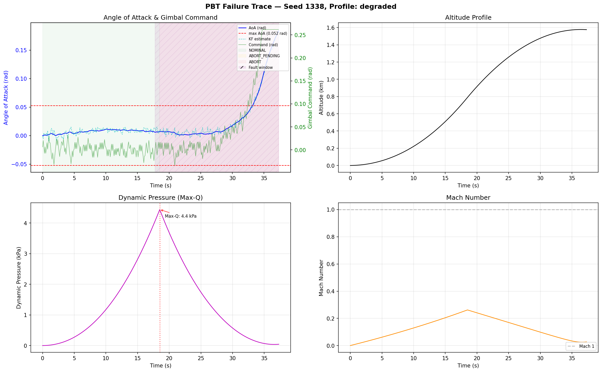

# Aegis - Safety verification toolchain
Aegis. This Greek word originates as being the protective shield / breastplate of Zeus and Athena, symbolizing divine protection. 
Aegis is a three-layer verification toolchain for safety-critical flight software: configuration validation, 3 Degree of Freedom (DoF) trajectory simulation with EKF sensor fusion, and property-based testing with automatic failure shrinking.

Built from the premise that the Mars Climate Orbiter was lost to a unit conversion error that a machine-checkable constraint would have caught.

--


## Architecture

```
                    YAML mission config
                          |
                    +-----v------+
                    |    MCV     |  validate, normalize units,
                    |  (Layer 1) |  enforce cross-field constraints
                    +-----+------+
                          |
                   compiled artifact
                   (canonical JSON + SHA-256)
                          |
                    +-----v------+
                    |    PBT     |  3-DoF sim + EKF sensor fusion,
                    |  (Layer 2) |  adversarial fault injection,
                    +-----+------+  automatic failure shrinking
                          |
                   failure bundles
                   (scenario + trace CSV + plot)
                          |
                    +-----v------+
                    | Assurance  |  requirements traceability,
                    |  (Layer 3) |  hazard log, safety case,
                    +------------+  traceability + safety case +
                                   bounded formal verification
```

**Layer 1 — MCV (Mission Configuration Verifier):** Parses a supported YAML/JSON subset with a zero-dependency parser, normalizes physical units (degrees to radians, percent to fraction), injects deterministic defaults, and enforces 17 cross-field constraints with explainable diagnostics. Emits a canonical JSON artifact with SHA-256 content hash.

**Layer 2 — PBT (Property-Based Testing):** Runs a compiled artifact through a 2D point-mass trajectory simulator (gravity, thrust, aerodynamic drag with Mach-dependent Cd, exponential atmosphere model). An Extended Kalman Filter fuses noisy IMU/GPS measurements; the PID controller uses the *estimated* AoA, not truth. Adversarial fault injection (sensor bias, packet loss, mode churn) probes 5 safety properties. Failures are automatically shrunk to minimal reproducing scenarios.

**Layer 3 — Assurance:** Machine-readable requirements traceability, hazard log, and safety case in YAML. The mode-transition state machine is specified in TLA+, and a bounded executable checker verifies formal properties (with counterexamples) over an explicit finite horizon. All three layers link together: hazards trace to requirements, requirements trace to properties, and properties trace to tests.

## What This Catches

| Property | Description | Mechanism |
|----------|-------------|-----------|
| PBT-001 | AoA stays within configured max | 3-DoF sim with fault injection |
| PBT-002 | Abort entered within 2s of request | Mode logic + deadline check |
| PBT-003 | Controller outputs remain finite | NaN/Inf detection on all steps |
| PBT-004 | Abort mode is absorbing | State transition monitoring |
| PBT-005 | EKF estimation error stays bounded | Kalman filter under sensor faults |
| FML-001 | Mode variable stays in domain | Bounded executable checker (aligned to TLA+ spec) |
| FML-002 | Abort is absorbing (formally) | Bounded executable checker (aligned to TLA+ spec) |
| FML-003 | Abort deadline always met | Bounded executable checker (aligned to TLA+ spec) |
| MCV-* | 17 config constraints | Cross-field validation |

## Quick Start

```bash
# Validate a mission config
python3 -m src.cli mcv validate configs/valid_mission.yaml

# Compile to canonical artifact
python3 -m src.cli mcv compile configs/valid_mission.yaml -o compiled.json

# To run property-based tests (example being 100 adversarial scenarios)
python3 -m src.cli pbt run compiled.json --runs 100 --profile degraded

# Full pipeline: validate -> compile -> PBT
python3 -m src.cli pipeline run configs/valid_mission.yaml --runs 50

# For parallel execution with benchmarks
python3 -m src.cli pipeline run configs/valid_mission.yaml --runs 200 --workers 4 --benchmark

# To visualize a failure trace (requires matplotlib)
pip install matplotlib
python3 -m src.cli pbt plot failures/<bundle_dir>

# To see semantic diff between configs
python3 -m src.cli mcv diff configs/valid_mission.yaml configs/semantic_same_units.yaml

# To run the assurance checks
python3 -m src.cli assurance check --output-dir .artifacts/assurance
```

## Example Output (actual CLI format)

```
$ python3 -m src.cli pipeline run configs/valid_tight_aoa.yaml --runs 5 --profile degraded
{
  "compiled_artifact": ".artifacts/compiled.json",
  "pbt": {
    "failure_count": 5,
    "profile": "degraded",
    "runs": 5
  }
}
```

A failure bundle contains everything needed to reproduce and diagnose:
```
failures/PBT-001_20260228_233000/
  scenario.json      # minimal reproducing scenario
  trace.csv          # full simulation trace (40+ fields)
  compiled_config.json  # exact compiled config used
  report.md             # property violation summary
  repro.sh              # deterministic replay command
```

## Trace Visualization

With matplotlib installed, `pbt plot` renders a 2x2 dashboard from any failure bundle:



Panels show angle of attack (with configured bounds and EKF estimate), altitude profile, dynamic pressure (with Max-Q annotation), and Mach number. Mode transitions are color-coded and fault injection windows are highlighted.

## 3-DoF Simulator

The trajectory simulator models a Falcon-like first stage:

- **Physics:** 2D point-mass with gravity, thrust (7.6 MN), aerodynamic drag with exponential atmosphere (rho_0 = 1.225 kg/m^3, H = 8500 m), Mach-dependent drag coefficient with transonic bump
- **Guidance:** Gravity turn pitch program with configurable kick angle and turn rate
- **Control:** PID gimbal controller with anti-windup, operating on EKF-estimated AoA
- **Sensor fusion:** 5-state Extended Kalman Filter [x, y, vx, vy, aoa] fusing IMU (100 Hz) and GPS (10 Hz) with fault-corrupted measurements
- **Fault injection:** Sensor bias, packet loss, mode churn - faults corrupt raw sensor readings before the EKF, so the controller must handle degraded estimates

## TLA+ Formal Specification

The mode-transition state machine (NOMINAL -> ABORT_PENDING -> ABORT) is specified in TLA+ at `formal/mode_logic.tla`. The repository executes a bounded state-space checker in Python (`src/assurance/formal_mode_logic.py`) that reports pass/fail and counterexamples for three formal properties:

- **FML-001:** Mode variable is always in {NOMINAL, ABORT_PENDING, ABORT}
- **FML-002:** ABORT is an absorbing state (once entered, never leaves)
- **FML-003:** Abort is entered within `AbortDelay` steps of the request

Scope note: this is bounded verification over a finite horizon, not full unbounded model checking with TLC.

## Project Structure

```
src/
  mcv/          # config parser, validator, compiler, differ (12 modules)
  pbt/          # generator, 3-DoF SUT, EKF, properties, runner, shrinker, plotter
  assurance/    # traceability, safety case, formal verification, catalog
  cli.py        # unified CLI entry point
  common/       # hashing, I/O, versioning
tests/          # 37 tests across 9 test files
configs/        # sample mission YAML files
formal/         # TLA+ mode logic specification
assurance/      # requirements, hazard log, safety case (YAML)
docs/           # architecture notes, trace figures
```

## Testing

```bash
# To run all 37 tests
python3 -m unittest discover -s tests -v

# To run the specific testing suites:
python3 -m unittest tests.pbt.test_kalman -v          # Kalman filter + PBT-005
python3 -m unittest tests.pbt.test_sut_3dof -v        # 3-DoF simulator
python3 -m unittest tests.pbt.test_plotting -v         # trace visualization
python3 -m unittest tests.assurance.test_formal_mode_logic -v  # bounded formal checker
```

## Design Decisions

- **Zero external dependencies:** The core toolchain runs on stdlib only. Matplotlib is an optional dependency for visualization. No numpy as the matrix algebra for the EKF is implemented from scratch with Gauss-Jordan elimination.
- **Deterministic by default:** Fixed seeds, `Pool.map` for ordered parallel execution, SHA-256 content hashing. Same input always produces same output.
- **Honest failure reporting:** The shrinker reduces failing scenarios to minimal reproductions. Failure bundles are self-contained and replayable. No silent suppression of violations for transparency.
- **Machine-checkable assurance:** Every requirement traces to a property, every property traces to a test, every hazard maps to mitigating requirements. The `assurance check` command verifies the entire chain.
